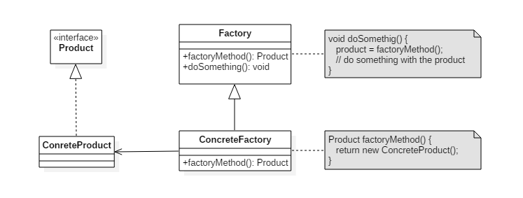

# 工厂方法模式

它定义了一个创建对象的接口，但由子类决定要实例化哪个类。工厂方法把实例化操作推迟到子类。
它主要由以下角色组成：
1. 抽象工厂（Abstract Factory）：提供了创建产品的接口，调用者通过它访问**具体工厂**的工厂方法 `factoryMethod()` 来**创建产品**。
2. 具体工厂（Concrete Factory）：主要是**实现**抽象工厂中的抽象方法，**完成具体产品的创建**。
3. 抽象产品（Product）：定义了产品的规范，描述了产品的主要特性和功能。
4. 具体产品（Concrete Product）：**实现**了抽象产品角色所定义的接口，由具体工厂来创建，它同具体工厂之间时**一对一**的关系。

(图来自 pdai.tech)