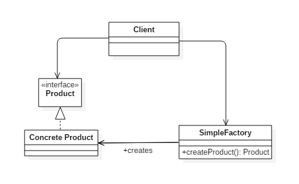

# 简单工厂模式

简单工厂模式专门定义一个类来负责创建其他类的实例，被创建的实例通常都具有共同的父类。

 

(图来自 pdai.tech)

我们有一个接口 Product，和两个具体实现了这个接口的真正商品类 ConcreteProduct1 和 ConcreteProduct2 。
为了避免在让客户频繁调用繁杂的代码根据类型创建具体想要的商品类，我们把创建的方法交由一个专门的类——简单工厂去完成，详情看 SimpleFactory 类和 Test 类。