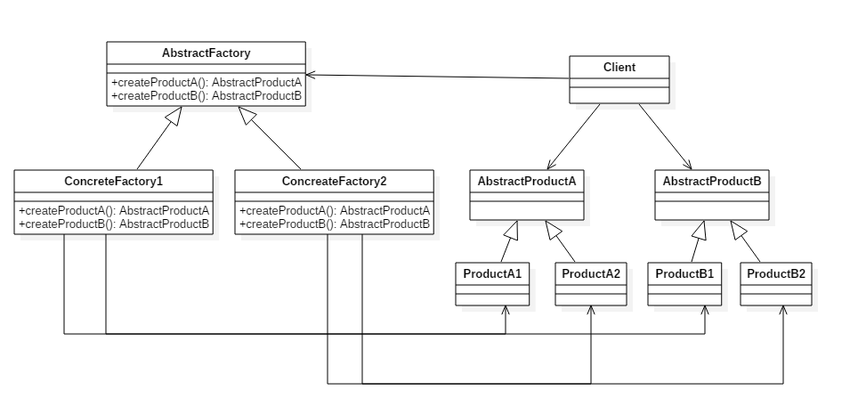
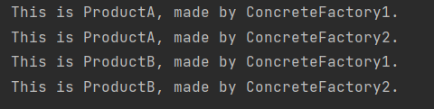

# 抽象工厂模式

是一种为访问类提供一个创建一组相关或相互依赖对象的接口，且访问类无须指定所要产品的具体类就能得到同族的不同等级的产品的模式结构。
它主要由以下角色组成：
1. 抽象工厂（Abstract Factory）：**提供创建产品的接口**，它包含多个创建产品的方法 `createProduct()` ，可以创建多个不同类型的产品，这由子类来决定。 
2. 具体工厂（Concrete Factory）：主要是**实现**抽象工厂中的多个抽象方法，**完成具体产品的创建**。
3. 抽象产品（Product）：定义了产品的规范，描述了产品的主要特性和功能，抽象工厂模式有**多个**抽象产品。
4. 具体产品（ConcreteProduct）：**实现**了抽象产品角色所定义的接口，由具体工厂来创建，它同**具体工厂**之间是**多对一**的关系。

可以这么说，抽象工厂模式使用了组合，而工厂方法模式使用了继承

(图来自 pdai.tech)

## 运行结果解释

`ConcreteFactory` 在创建具体的 `Product` 时，才赋予他特殊的特性，如这里的 "made by ..."。